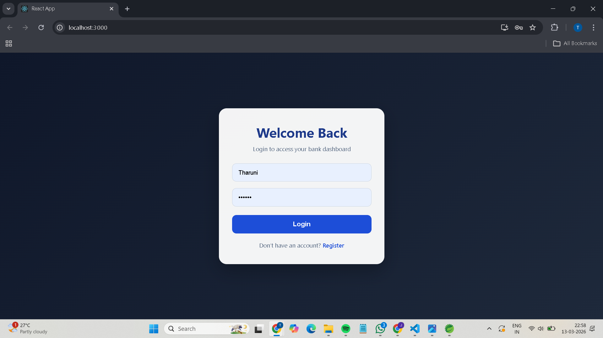
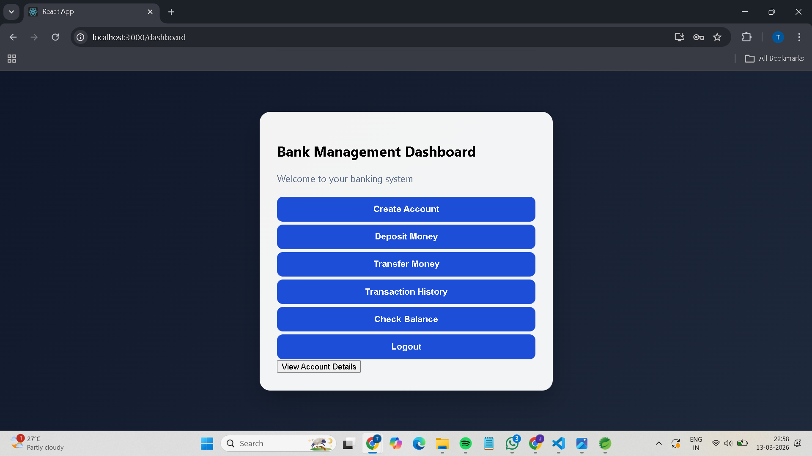

# Bank Management System

A full-stack Bank Management System built using Spring Boot, React, and MySQL.

## Features
- User Registration and Login
- JWT Authentication
- Create Account
- Deposit Money
- Transfer Money
- Check Balance
- View Account Details
- Transaction History

## Tech Stack

### Backend
- Java
- Spring Boot
- Spring Security
- JWT
- MySQL
- Spring Data JPA

### Frontend
- React
- Axios
- React Router DOM
- CSS

## Project Structure

backend → Spring Boot application  
frontend → React application

## How to Run

### Backend
1. Open backend in Spring Tool Suite
2. Configure MySQL in application.properties
3. Run Spring Boot application

### Frontend
1. Open frontend in VS Code
2. Run `npm install`
3. Run `npm start`

## Screenshots

### Login Page

### Dashboard

### Transfer Money

### Check Balance

### Transaction History

